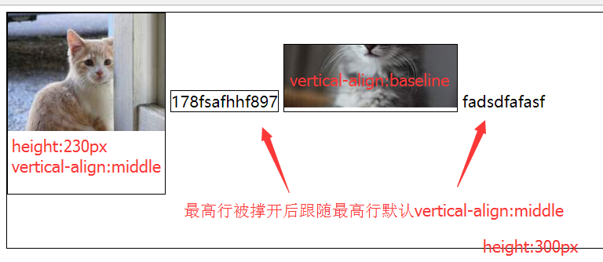
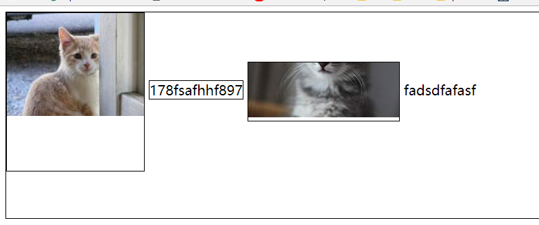
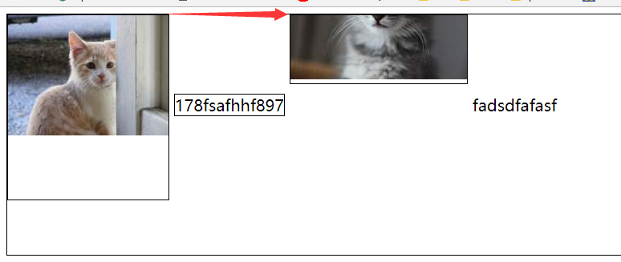
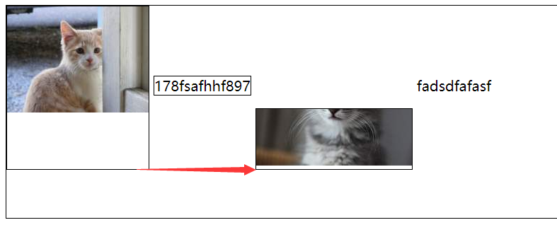
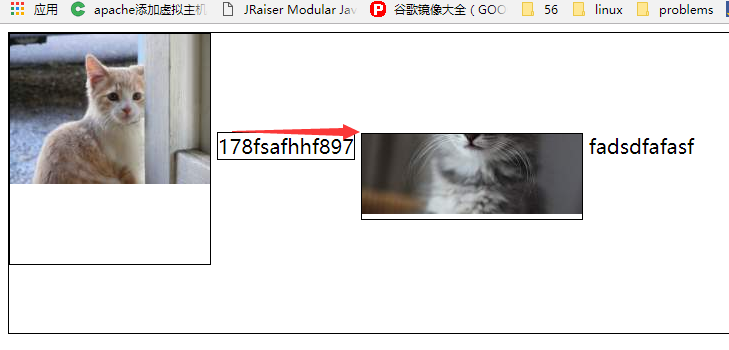
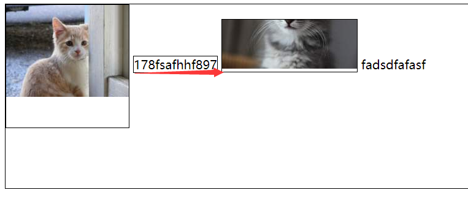
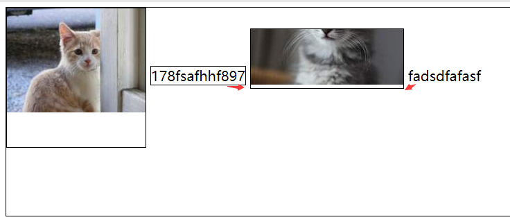
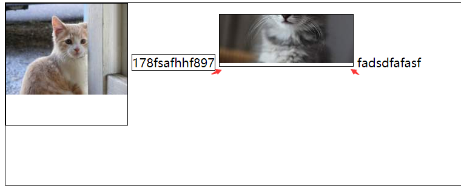

##	Concept

####	vertical-align

用来指定行内元素（inline）或表格单元格（table-cell）元素的垂直对齐方式。

	vertical-align:	baseline | sub | super | text-top | text-bottom | middle | top | bottom | <percentage> | <length>

行内元素设置其中一个vertical-align会影响其它行内元素的布局。
经实践，**以撑开行height值最高那个元素决定其它元素的位置布局**。

结构代码：

	

        
        178fsafhhf897
        
        fadsdfafasf
    

样式代码：
	
	p{
        height: 300px;
        border: 1px solid #000;
        font-size: 20px;
        margin: 0;
    }
    .a{
        display: inline-block;
        vertical-align: middle;
        height: 200px;
        border: 1px solid;
    }
    .b{
        display: inline-block;
        border: 1px solid;
    }
    .c{
        display: inline-block;
        border: 1px solid;
    }
以第二张图为例

baseline（default）：

middle：垂直居中显示

top：撑开行的顶部对齐

bottom：撑开行的底部对齐

text-top：文本顶部对齐

text-top：文本底部对齐

sub：文本底部下一点

super：文本底部上一点

[https://segmentfault.com/a/1190000007663895](https://segmentfault.com/a/1190000007663895)

####	display:flex

有两个轴，主轴（main axis）和交叉轴（cross axis）。默认情况下，主轴是水平的，交叉轴是垂直的。

*	属性

	flex-direction：决定主轴的方向

		flex-direction：row | row-reverse | column | column-reverse;

	flex-wrap：定义如果一条轴线排不下，如何换行。

		flex-wrap: nowrap | wrap | wrap-reverse;

	justify-content：定义项目在主轴上的对齐方式。

		justify-content: flex-start | flex-end | center | space-between | space-around;

	align-items：定义项目在交叉轴上如何对齐。

		align-items: flex-start | flex-end | center | baseline | stretch(default);

	align-content：定义多根轴线的对齐方式（这里应该是多层flex的情况）。如果项目只有一根轴线，该属性不起作用。

		align-content: flex-start | flex-end | center | space-between | space-around | stretch(default);

		

####	Promise

	
	new Promise(function(resolve, reject) {
	  //do something here
	  //when do something done
	  resolve();
	});
	
	
	then(function(){
	  //resolve
	}, function () {
	  //reject
	  //这里如果没有明确返回Promise对象并且reject，那么将把返回结果给到后面then的resolve状态中。
	})

	
then可以使用链式调用的写法原因在于，每一次执行该方法时总是会返回一个Promise对象。另外，在then onFulfilled的函数当中的返回值，可以作为后续操作的参数。then里面如果是Promise对象，那么可以通过Promise里面的resolve或者reject来决定后续then的状态,或者return消息传给后面then作为函数参数。

Promise的抛错具有冒泡性质，能够不断传递，这样就能够在下一个catch()中统一处理这些错误。同时catch()也能够捕获then()中抛出的错误，所以建议不要使用then()的rejected回调，而是统一使用catch()来处理错误。

可以通过构造函数的方式来建立一个Promise对象new Promise，也可以通过直接调用Promise函数上面的reject、resolve方法来执行。

####	valueOf

方法返回指定对象的原始值。一般==，不===。