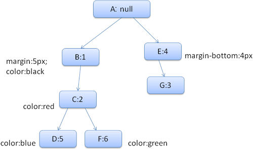

##	浏览器是如何工作的

####	浏览器的主要组件：

用户界面 - 这包括地址栏，后退/前进按钮，书签菜单等浏览器的每个部分显示除了主窗口，你看到请求的页面。

浏览器引擎 - 查询和操作渲染引擎的界面（Webkit、Gecko等）。

渲染引擎 - 负责显示请求的内容。例如，如果请求的内容是HTML，则它负责解析HTML和CSS，并在屏幕上显示解析的内容。

网络 - 用于网络呼叫，如HTTP请求。它具有与平台无关的接口，并在每个平台的底层实现。

UI后端 - 用于绘制组合框和窗口等基本小部件。它暴露了一个通用接口，不是平台特定的。它下面使用操作系统用户界面方法。

JavaScript解释器。用于解析和执行JavaScript代码。

数据存储 - 这是一个持久层。浏览器需要保存硬盘上的各种数据，例如cookie。新的HTML规范（HTML5）定义了“web数据库”，它是浏览器中一个完整的（尽管是轻量级的）数据库。	

####	布局：

1、父渲染器决定自身的宽度

2、	

a.	放置子元素渲染器（设置x和y）

b.	需要的情况下进行子元素布局（需要计算子元素的高）

3、父元素使用所有子元素的高和padding、margin、border来设置自身的高，这里也会被父渲染器的父元素使用

####	HTML解析

HTML解析器有容错机制，浏览器上不会出现HTML解析错误的信息。
	
HTML解析完成时的操作
在此阶段，浏览器会将文档标记为交互式，并开始解析处于“deferred”模式的脚本 - 在解析文档后应执行的脚本。文档状态将被设置为“complete”，并且“load”事件将被触发。

####	样式解析
	
一、	计算样式的一些困难：

1. 样式数据是非常大的结构，保存大量的样式属性会带来内存问题。
2. 如果不进行优化，找到每个元素匹配的规则会导致性能问题，为每个元素查找匹配的规则都需要遍历整个规则表，这个过程有很大的工作量。选择符可能有复杂的结构，匹配过程如果沿着一条开始看似正确，后来却被证明是无用的路径，则必须去尝试另一条路径。
3. 样式上下文包含最终值，这些值是通过以正确顺序应用所有匹配的规则，并将它们由逻辑值转换为具体的值，例如，如果逻辑值为屏幕的百分比，则通过计算将其转化为绝对单位。

二、	CSS选择器从右向左的匹配规则

1.	主要是匹配规则的性能问题。从右向左匹配可以在第一步就筛选掉了大量的不符合条件的最右节点（叶子节点），而从左向右匹配意味着由树顶向下匹配，会浪费大量时间在失败的子节点查找上

三、	css**建立**解析规则例子

1.	HTML结构

		<HTML>
			<BODY>
				

					

		                          这是一个大错误</ span>
		                          这也是
		                          非常大的错误</ span>错误
		        		</ p>
				</ DIV>
				
另一个错误</ div>
		    	</ BODY>
		</ HTML>

2.	css规则

		1.	div {margin：5px; color：black}
		2.	err {color：red}
		3.	big {margin-top：3px}
		4.	div span {margin-bottom：4px}
		5.	#div1 {color：blue}
		6.	#div2 {color：green}

3.	css parser结构图	
	
	

	上下文树如下（这里是匹配树，是从右往左进行匹配）
	
	

	（个人理解，建立的过程自上而下快一点）从左到右可以看成从上到下来**建立**css parser节点，如果其中某些树枝已存在相应的节点，那么在其中某个树节点上面新开一条树枝出来，继续精确匹配右边的选择器。

	假设我们解析HTML并得到第二个div标签。我们需要为这个节点创建一个样式上下文，并填充它的样式结构。 我们将匹配规则，发现div的匹配规则是1，2和6。这意味着在树中已经存在一个已经存在的路径，我们的元素可以使用，我们只需要添加另一个节点给它规则6（规则树中的节点F）。